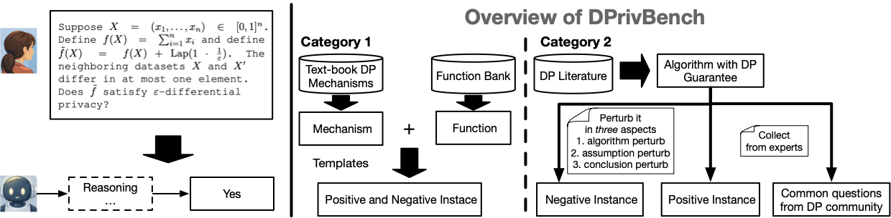

# DPriv-Bench: Benchmarking LLMs’ Reasoning for Differential Privacy

[](https://arxiv.org/abs/2604.15851) | [](https://huggingface.co/datasets/erchiw/DPriv-Bench) | Website coming soon!

**DPriv-Bench** is a benchmark for evaluating whether language models can correctly reason about and verify claimed differential privacy (DP) guarantees from natural-language/LaTeX-format problem statements.



- **Category 1** tests fundamental mechanism reasoning (Laplace, Gaussian, and selection mechanisms under several DP formalisms).
- **Category 2** tests algorithm-level claims drawn from the research literature across 18 topics (Table 6 of the [paper](https://arxiv.org/abs/2604.15851))
- The **Hard track** augments a subset of Category 2 items with **related theorems and definitions** in the prompt.

---

## Dataset Overview

| Track | Focus | Questions | Labels |
|---|---|---|---|
| **Category 1** | Mechanism-level DP questions (6 topics × 98) | **588** | `1` = yes, `0` = no |
| **Category 2** | Algorithm-level questions (LaTeX, from research literature) | **125** | `1` / `0` |
| **Hard track** | Category 2 subset with linked theorems/definitions | **18** (default) | `1` / `0` |

**Category 1 topics:** `laplace_mechanism`, `gaussian_mechanism_GDP`, `gaussian_mechanism_zCDP`, `selection_mechanism_expoMech_pureDP`, `selection_mechanism_LaplaceRNM_pureDP`, `selection_mechanism_PF_pureDP`

---

## Loading the Dataset

### From Hugging Face (recommended)

```python
from datasets import load_dataset

# Category 1 — pick one config name from the six topics
ds = load_dataset("erchiw/DPriv-Bench", "cate_1_Laplace_pureDP", split="test")

# Category 2
ds = load_dataset("erchiw/DPriv-Bench", "cate_2", split="test")
```

Available Category 1 config names:

| `--topic` argument | HuggingFace config |
|---|---|
| `laplace_mechanism` | `cate_1_Laplace_pureDP` |
| `gaussian_mechanism_GDP` | `cate_1_Gaussian_GDP` |
| `gaussian_mechanism_zCDP` | `cate_1_Gaussian_zCDP` |
| `selection_mechanism_expoMech_pureDP` | `cate_1_ExpoMech_pureDP` |
| `selection_mechanism_LaplaceRNM_pureDP` | `cate_1_LaplaceRNM_pureDP` |
| `selection_mechanism_PF_pureDP` | `cate_1_PF_pureDP` |

### From local files

If you have the benchmark data on disk under `data/`, each file is a pandas-style JSON records array loadable with `pandas.read_json`:

- **Category 1** — `data/category_1/cate_1_<config>.json` (e.g. `cate_1_Laplace_pureDP.json`): each record has `question_id`, `question`, `label`, `function_id`, `function`, `function_sens`.
- **Category 2** — `data/category_2/cate_2.json`: each record has `question_id`, `question_tex`, `label`, `subject`, `topic`, and richer metadata.
- **Hard track** — question text and labels come from `cate_2.json`; theorem/definition text in `difficult_question/theorem/<id>.tex`; links in `difficult_question/question_theorem_link.json`.

---

## Running Evaluations

**Step 1 — Set API keys**

```bash
export OPENAI_API_KEY=...        # gpt-5-*
export ANTHROPIC_API_KEY=...     # claude-sonnet, claude-opus
export GOOGLE_API_KEY=...        # gemini-*
export DEEPSEEK_API_KEY=...      # DeepSeek-V3.1, DeepSeek-R1
```

**Step 2 — Run evaluations** (default data source: HuggingFace; add `--data_source local` to load from `data/`)

```bash
# Category 1 — one topic at a time
python run_and_eval/run_category_1.py --model gpt-5-minimal --task dp-judge --topic laplace_mechanism --seed 0
python run_and_eval/judge_category_1.py \
  --predictions_path response_category_1/dp-judge_laplace_mechanism_hard_gpt-5-minimal_cot_0_predictions.json

# Category 2
python run_and_eval/run_category_2.py --model gpt-5-minimal --task dp-judge --seed 0
python run_and_eval/judge_category_2.py \
  --predictions_path response_category_2/dp-judge_gpt-5-minimal_cot_0_predictions.json

# Hard track (theorem-augmented)
python run_and_eval/run_hard_question.py --model gpt-5-minimal --task algo-judge-w-proof --seed 0
python run_and_eval/judge_category_2.py \
  --predictions_path response_hard_question/algo-judge-w-proof_gpt-5-minimal_cot_0_predictions.json

```

---

## Output Files

Each run script writes results under the current working directory:

| Directory | `*_responses.json` | `*_predictions.json` |
|---|---|---|
| `response_category_1/` | Raw model responses | `{question_id, pred, label, function_id}` |
| `response_category_2/` | Raw model responses | `{question_id, pred, label, category, topic}` |
| `response_hard_question/` | Raw model responses | `{question_id, pred, label, category, topic}` |

Predictions use `pred = 1` (yes), `pred = 0` (no), `pred = -1` (unparseable).

**Runs resume automatically**: if a responses file already exists with some answered question IDs, only the remaining questions are sent to the model.

---

## Supported Models

**OpenAI API:** `gpt-5-high`, `gpt-5-minimal`, `gpt-5-low` (GPT-5 with high/minimal/low reasoning effort, respectively)

**Google GenAI API:** `gemini-flash` (Gemini 2.5 Flash), `gemini-pro` (Gemini 2.5 Pro), `gemini-3` (Gemini 3.1 Pro)

**Anthropic API:** `claude-sonnet` (Claude Sonnet 4.5), `claude-opus` (Claude Opus 4.5)

**OpenAI-compatible API:** `DeepSeek-V3.1`, `DeepSeek-R1`

**vLLM (local):** `Goedel-Prover` (Goedel-Prover-V2-32B), `qwen3-30b-think` (Qwen3-30B-A3B-Thinking), `qwen3-30b-instruct` (Qwen3-30B-A3B-Instruct)

**Custom models** are also supported:
- **Custom API** — set `CUSTOM_BASE_URL` (and optionally `CUSTOM_API_KEY`) and pass any model name string.
- **Custom local (vLLM)** — pass `--download_path /path/to/cache` with any HuggingFace checkpoint ID as `--model`.

---


## How to Contribute

Details will be available soon! In the meantime, please contact: erw011@ucsd.edu and ruihan.wu14@gmail.com or open a GitHub issue.

## Citation

If you use DPriv-Bench in your research, please cite:

```bibtex
@misc{dprivbenchauthors,
  title        = {DPrivBench: Benchmarking LLMs' Reasoning for Differential Privacy},
  author       = {Erchi Wang and Pengrun Huang and Eli Chien and Om Thakkar and Kamalika Chaudhuri and Yu-Xiang Wang and Ruihan Wu},
  year         = {2026},
  eprint       = {2604.15851},
  archivePrefix = {arXiv},
  primaryClass = {cs.LG},
  url          = {https://arxiv.org/abs/2604.15851},
}
```
